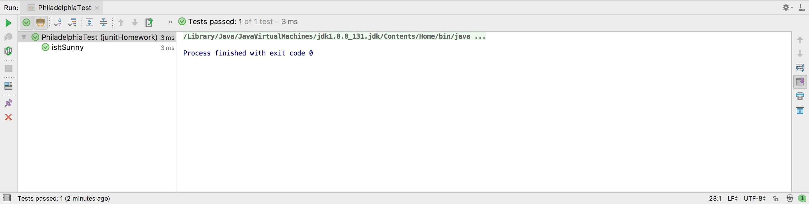
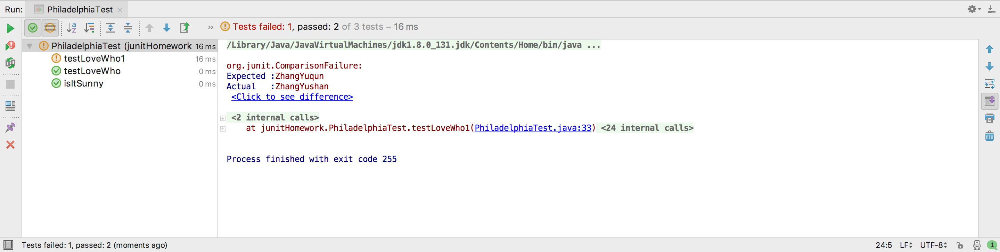
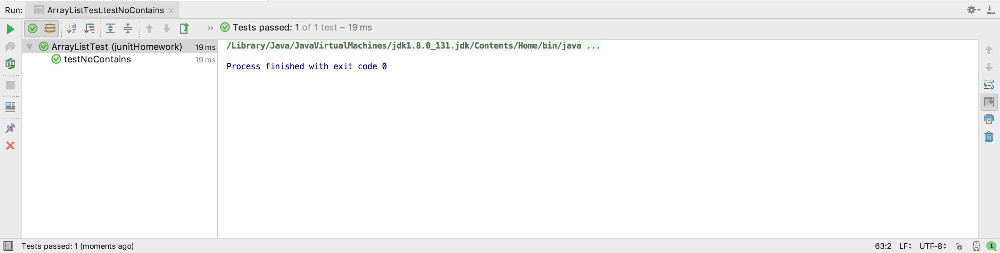
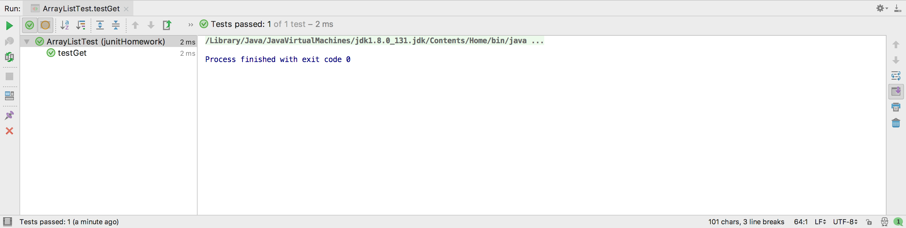
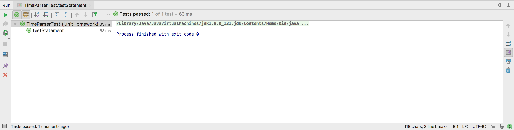
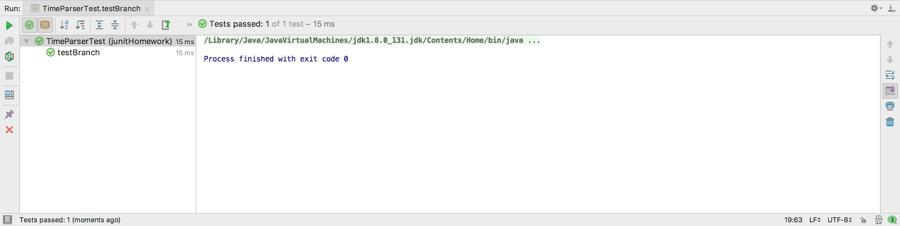
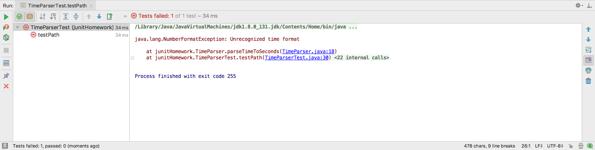
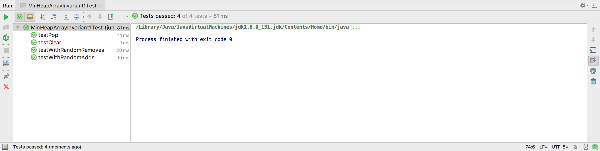

#软件工程Lab5
######<p align="right">11510365 薛毅恒</p>
-
##Exercise 1
-	Run the test described above and verify that you get the same output.
-	Add a test in which an assertion fails (hint: use assertFalse and your sunny Philadelphia code). Describe (very briefly) what has changed in the test results.



-	Choose one other static assertion method from the jUnit Assert API and call it (this will be useful). Give the test that you wrote and describe the results.

```java
    public static String loveWho(){
        String name = "ZhangYushan";
        return name;
    }
``` 
>判断字符串是否与预设完全一样，完全一样则test成功，否则failed。

-	Write a new test that throws an exception when it is triggered. Run the tests again. Give the test that you wrote and describe the results.

>测试文件如下：

```java
    @Test
    public void testLoveWho(){
        String name = "ZhangYushan";
        assertEquals(name, Philadelphia.loveWho());
    }

    @Test
    public void testLoveWho1(){
        String name = "ZhangYuqun";
        assertEquals(name, Philadelphia.loveWho());
    }
```


>测试文件读取java中return的信息之后，通过`assertEquals`进行比较，不符合要求的会failed，窗口会提示其所期待的信息。


##Exercise 2
-	Run the test fixture described above and verify that you get the same output.


-	Add a test that uses the testArray, tests the "clear" method, and verifies that the array is empty. Copy your test into your document for submission.

```java
     @Test
    public void testClear(){
         testArray.clear();
         assertTrue(testArray.isEmpty());
     }
```


>通过`testClear`判断是否为空，通过`assertTrue`返回值来决定test是否通过。

-	Add a test that uses the testArray and tests the "contains" method by verifying that it returns true when supplied a value that exists in the array. Copy your test into your document for submission.

```java
     @Test
    public void testContains(){
         assertTrue(testArray.contains(3));
     }
```


-	Add a test that uses the testArray and tests the "contains" method by verifying that it returns false when supplied a value that does not exist in the array. Copy your test into your document for submission.

```java
     @Test
    public void testNoContains(){
         assertFalse(testArray.contains(2));
     }
```


     
-	Add a test that uses the testArray and tests the "get" method by verifying that it returns the correct value for a given index. Copy your test into your document for submission.

```java
     @Test
    public void testGet(){
         assertEquals(testArray.get(0), new Integer(3));
     }
```


     

##Exercise 3
-	Write a minimal test suite that provides full statement coverage (e.g., write the shortest test suite you can think of that provides full statement coverage).

```java
    @Test
    public void testStatement() {
        assertEquals(1, TimeParser.parseTimeToSeconds("0:00:01 am"));
    }
```


    
-	Write a minimal test suite that provides full branch coverage.

```java
    @Test
    public void testBranch(){
        ExpectedException.none().expect(NumberFormatException.class);
        ExpectedException.none().expectMessage("Unrecognized time format");
        assertEquals(2, TimeParser.parseTimeToSeconds("0:00:02 am"));

        ExpectedException.none().expect(IllegalArgumentException.class);
        ExpectedException.none().expectMessage("Unacceptable time specified");
        assertEquals(1, TimeParser.parseTimeToSeconds("0:00:01 am"));
    }
```
    

    
-	Write a minimal test suite that provides full path coverage. If any paths are not possible to test, describe why.

```java
    @Test
    public void testPath() {
        ExpectedException.none().expect(NumberFormatException.class);
        ExpectedException.none().expectMessage("Unrecognized time format");
        assertEquals(1, TimeParser.parseTimeToSeconds("00001 am"));

        ExpectedException.none().expect(NumberFormatException.class);
        ExpectedException.none().expectMessage("Unacceptable time specified");
        assertEquals(1, TimeParser.parseTimeToSeconds("0:00:01 am"));
    }
```

    
>时间格式必须是`hh/mm/ss`才可以通过，格式如`00001`会失败。

##Exercise 4

```java
    private boolean invariantHolds() {
        Integer top = heap.peek();
        if (top == null) {
            return true;
        }
        Integer[] contents = new Integer[heap.size()];
        contents = heap.toArray(contents);
        for (int i = 0; i < (heap.size() - 1) / 2; i++) {
            if (contents[i] > contents[2 * i + 1] || contents[i] > contents[2 * i + 2]) {
                System.out.println("Whoops!");
                return false;
            }
        }
        return true;
    }
```
    
